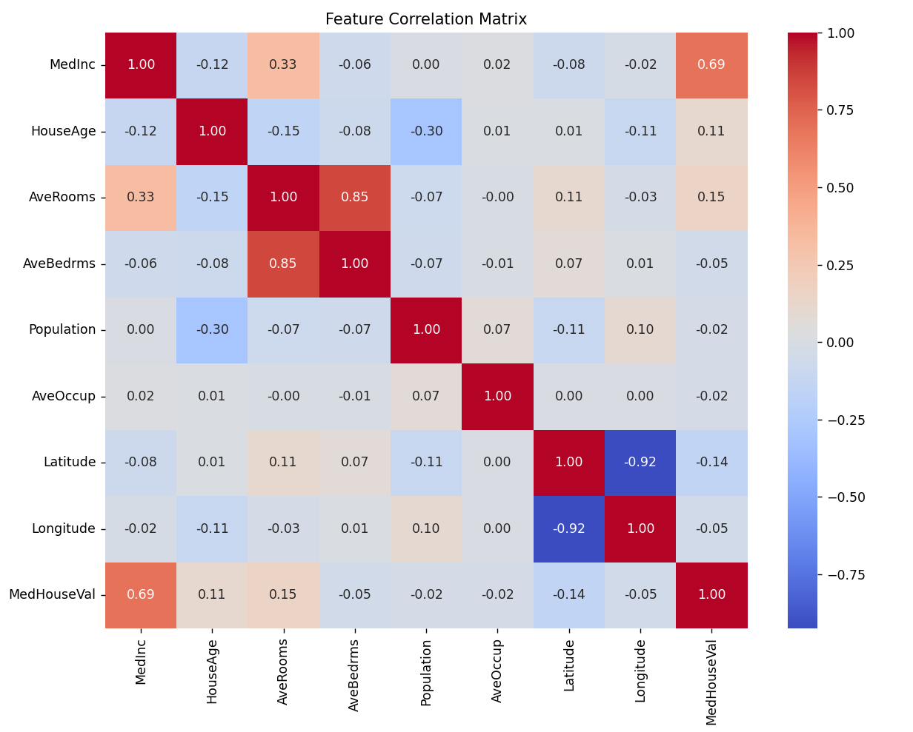
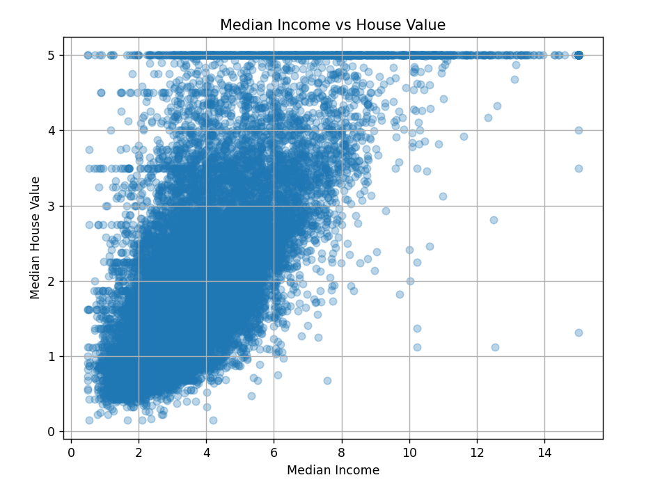
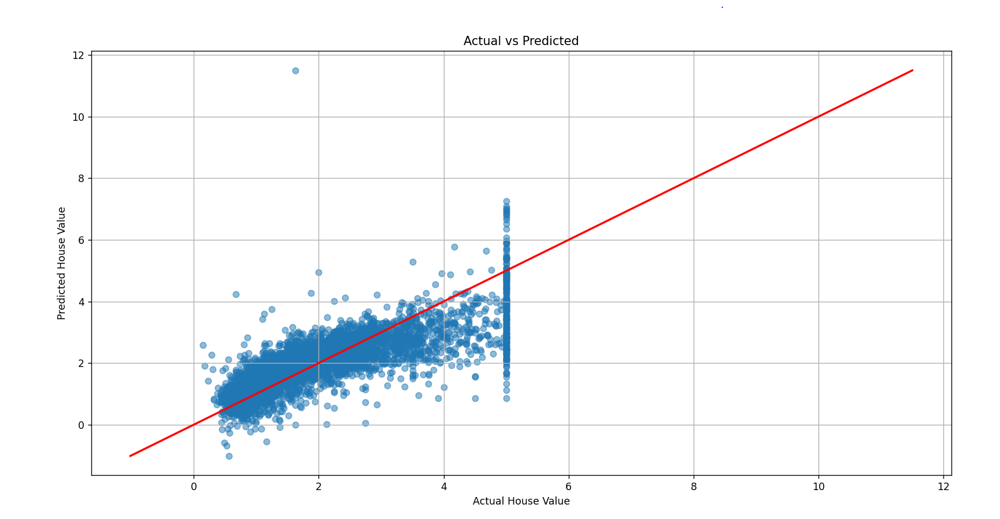
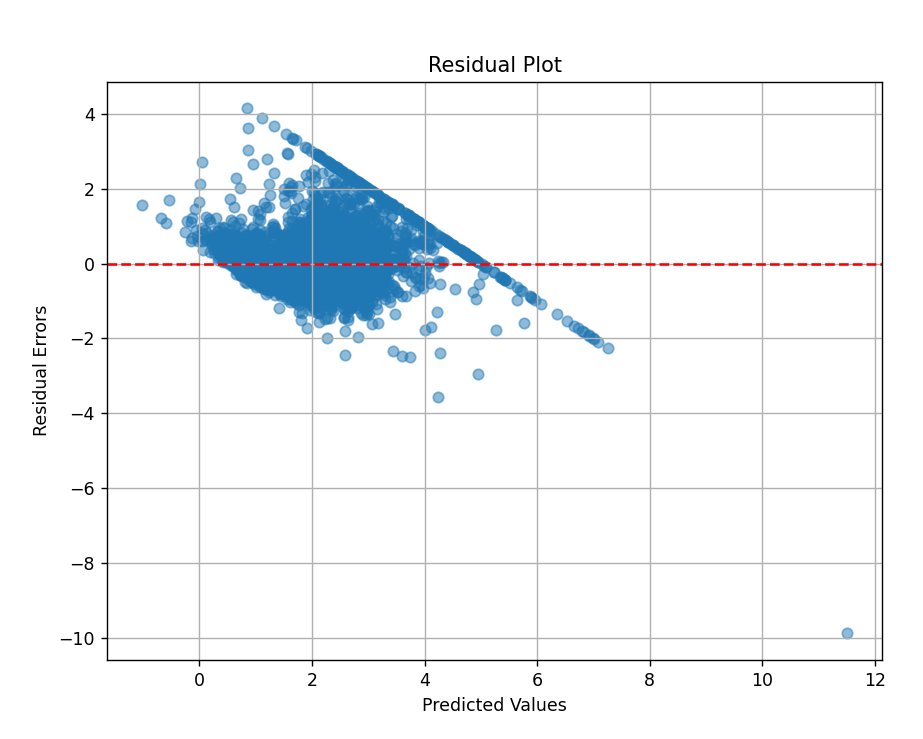

# House Price Prediction using Linear Regression

A beginner-friendly Machine Learning project that predicts California house prices using Linear Regression and the Scikit-Learn library.

## Project Overview

This project demonstrates the complete Machine Learning workflow:

* Loading a real-world dataset
* Exploratory Data Analysis (EDA)
* Data visualization
* Feature selection
* Model training
* Model evaluation
* House price prediction
* Regression diagnostics

The project uses the California Housing Dataset provided by Scikit-Learn.

---

## Dataset

The California Housing Dataset contains information collected from California census block groups.

### Features

| Feature    | Description                 |
| ---------- | --------------------------- |
| MedInc     | Median income               |
| HouseAge   | Median house age            |
| AveRooms   | Average number of rooms     |
| AveBedrms  | Average number of bedrooms  |
| Population | Population in block         |
| AveOccup   | Average household occupancy |
| Latitude   | Latitude coordinate         |
| Longitude  | Longitude coordinate        |

### Target Variable

| Target      | Description        |
| ----------- | ------------------ |
| MedHouseVal | Median house value |

---

## Machine Learning Algorithm

This project uses Linear Regression.

Linear Regression attempts to model the relationship between input features and a target variable by fitting a linear equation.

The prediction equation is:

ŷ = b₀ + b₁x₁ + b₂x₂ + ... + bₙxₙ

Where:

* ŷ = Predicted house value
* b₀ = Intercept
* b₁...bₙ = Learned coefficients
* x₁...xₙ = Input features

---

## Technologies Used

* Python
* Pandas
* Matplotlib
* Seaborn
* Scikit-Learn

---

## Project Structure

```text
house-price-project/
│
├── house_price_prediction.py
├── requirements.txt
└── README.md
```

---

## Installation

Clone the repository:

```bash
git clone https://github.com/your-username/house-price-project.git
```

Move into the project directory:

```bash
cd house-price-project
```

Install required packages:

```bash
pip install -r requirements.txt
```

---

## Running the Project

Execute the Python script:

```bash
python house_price_prediction.py
```

---

## Visualizations

The project generates the following visualizations:

### 1. Correlation Heatmap

Shows relationships between features and the target variable.

### 2. Median Income vs House Value Scatter Plot

Visualizes the strongest predictor in the dataset.

### 3. Actual vs Predicted Values

Compares model predictions with actual house values.

### 4. Residual Plot

Helps identify prediction errors and model behavior.

---

## Evaluation Metrics

The model is evaluated using:

### R² Score

Measures how well the model explains variance in the target variable.

* 1.0 = Perfect prediction
* 0.0 = No predictive power

### Mean Absolute Error (MAE)

Average absolute difference between actual and predicted values.

### Mean Squared Error (MSE)

Average squared difference between actual and predicted values.

Lower values indicate better performance.

---

## Example Output

```text
Training Linear Regression Model...

Training Completed!

Model Performance

Mean Absolute Error : 0.5332
Mean Squared Error  : 0.5559
R² Score            : 0.5758
```

Note: Results may vary slightly depending on library versions.

---

## Visualizations

### Feature Correlation Matrix 


### Median Income vs House Value



### Actual vs Predicted



### Residual Plot



---
## Output

Loading California Housing Dataset...

============================================================
DATASET INFORMATION
============================================================
Rows and Columns:
(20640, 9)

Column Names:
['MedInc', 'HouseAge', 'AveRooms', 'AveBedrms', 'Population', 'AveOccup', 'Latitude', 'Longitude', 'MedHouseVal']

First 5 Records:
   MedInc  HouseAge  AveRooms  ...  Latitude  Longitude  MedHouseVal
0  8.3252      41.0  6.984127  ...     37.88    -122.23        4.526
1  8.3014      21.0  6.238137  ...     37.86    -122.22        3.585
2  7.2574      52.0  8.288136  ...     37.85    -122.24        3.521
3  5.6431      52.0  5.817352  ...     37.85    -122.25        3.413
4  3.8462      52.0  6.281853  ...     37.85    -122.25        3.422

[5 rows x 9 columns]

============================================================
STATISTICAL SUMMARY
============================================================
             MedInc      HouseAge  ...     Longitude   MedHouseVal
count  20640.000000  20640.000000  ...  20640.000000  20640.000000
mean       3.870671     28.639486  ...   -119.569704      2.068558
std        1.899822     12.585558  ...      2.003532      1.153956
min        0.499900      1.000000  ...   -124.350000      0.149990
25%        2.563400     18.000000  ...   -121.800000      1.196000
50%        3.534800     29.000000  ...   -118.490000      1.797000
75%        4.743250     37.000000  ...   -118.010000      2.647250
max       15.000100     52.000000  ...   -114.310000      5.000010

[8 rows x 9 columns]

Missing Values:
MedInc         0
HouseAge       0
AveRooms       0
AveBedrms      0
Population     0
AveOccup       0
Latitude       0
Longitude      0
MedHouseVal    0
dtype: int64

Feature Matrix Shape: (20640, 8)
Target Shape: (20640,)

Training Samples : 16512
Testing Samples  : 4128

Training Linear Regression Model...
Training Completed!

============================================================
MODEL COEFFICIENTS
============================================================
Intercept:
-37.02327770606416

Feature Contributions:
MedInc          -> 0.448675
HouseAge        -> 0.009724
AveRooms        -> -0.123323
AveBedrms       -> 0.783145
Population      -> -0.000002
AveOccup        -> -0.003526
Latitude        -> -0.419792
Longitude       -> -0.433708

============================================================
MODEL PERFORMANCE
============================================================
Mean Absolute Error : 0.5332
Mean Squared Error  : 0.5559
R² Score            : 0.5758

## Learning Objectives

This project helps understand:

* Supervised Learning
* Regression Problems
* Linear Regression
* Data Splitting
* Model Evaluation
* Feature Relationships
* Visualization Techniques
* End-to-End Machine Learning Workflow

---

## Future Improvements

Potential enhancements include:

* Polynomial Regression
* Ridge Regression
* Lasso Regression
* Random Forest Regressor
* XGBoost Regressor
* Hyperparameter Tuning
* Cross Validation
* Feature Engineering
* Model Deployment using Flask or FastAPI

---

## References

* California Housing Dataset from Scikit-Learn
* Scikit-Learn Documentation
* Pandas Documentation
* Matplotlib Documentation
* Seaborn Documentation

---

## License

This project is released under the MIT License.

Feel free to use, modify, and distribute it for educational purposes.
